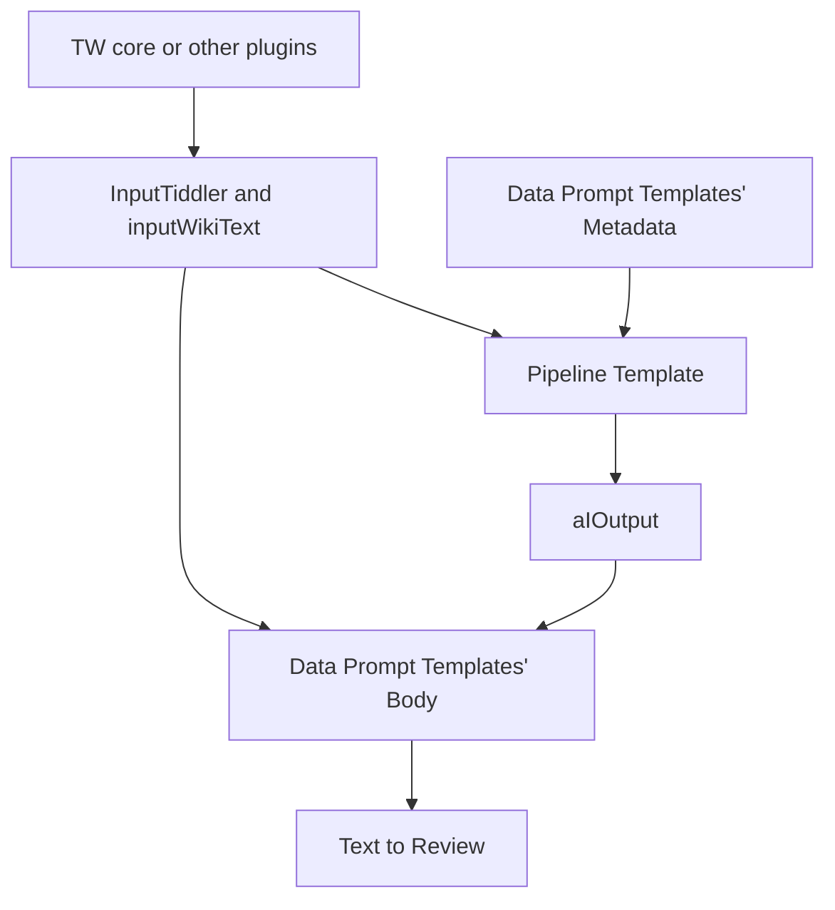

# TiddlyWiki-LLM-dataset

WikiText syntax dataset for auto UI generation in TiddlyWiki.

## Overview

1. Read folders in the config. This will create snapshot of TW core and plugins. And skip the duplication if text is same as first item's input (See [Data](./data/Readme.md) for detail about snapshot).
1. Generate more QA pair with templates
1. Generate missing Q or A using LLM
1. Generate review API call and upload to review platform
1. Ask community for help reviewing
1. Import updated wikitext when TiddlyWiki version bump and rerun the above pipeline
1. Export dataset for LLM fine-tune

## AI prompt

We generate material so human don't need to create them from scratch.

### Data

Prompts are WikiText tiddlers with variable transclusion, in the [wiki's 'prompts](./wiki/tiddlers/prompts/data) folder.

Each tiddler's wikified body will be put to review platform. And they can use following variables from pipeline.

- `InputTiddler` `.tid` file content with metadata part, read from TW core or other plugins.
- `inputWikiText` Text part of tiddler, extracted by pipeline
- `aIOutput` GPT generated output, generated by pipeline

### Pipeline

1. Use pure JS to get `InputTiddler` and `inputWikiText`
1. These variables will be available in tiddlers in the [pipeline's 'prompts](./wiki/tiddlers/prompts/pipeline) folder.
1. We process "input" X "Data prompt tiddler" matrix member one by one, we can get `prompt` field of data tiddler, as `DataPrompt` variable
1. Compose the variables using WikiText, and we use wikified tiddler text as AI input, to get the content for `aIOutput` variable.

## Review

In the review platform, there are "original language" and "translation" areas, because we are using a translating review platform.

Original WikiText + AI prompt that generate the material will be the "original language", and AI generated chat material can will put in the "translation" area, open for human to review.

You can join the project in [Paratranz](https://paratranz.cn/projects/12129), and review each material, edit them to be correct (AI will have mistake, they don't understand WikiText well, because there was never good learning material before like we are creating).

## How to run

1. Have [Deno](https://deno.com/) installed
1. Get a [DeepSeek API key](https://platform.deepseek.com/api_keys) or OpenAI API key, put it in a `.env` file, copied from [.env.template](./.env.template) file.
1. Run `deno task dev`
